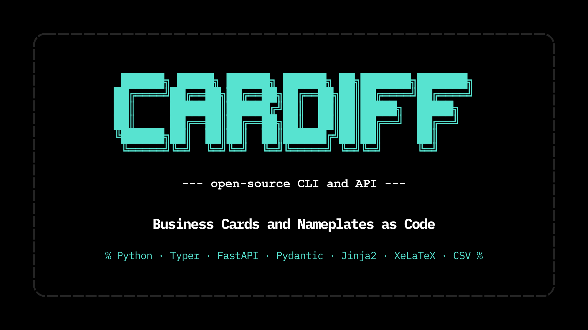

<a id="readme-top"></a>

<div align="center">

[![Contributors][contributors-shield]][contributors-url]
[![Forks][forks-shield]][forks-url]
[![Stargazers][stars-shield]][stars-url]
[![Issues][issues-shield]][issues-url]
[![Apache License][license-shield]][license-url]
[![LinkedIn][linkedin-shield]][linkedin-url]

</div>

<div align="center">
  <a href="https://github.com/zcalifornia-ph/cardiff">
    
  </a>

  <h3 align="center">CARDIFF</h3>

  <p align="center">
    <strong>Business cards as code.</strong>
  </p>

  <p align="center">
    Cardiff is an open-source rendering platform for standardized, print-ready business cards and adjacent identity materials.
    It turns structured records into validated render requests and reusable render outputs that later CLI, batch, and API workflows can share without drift.
  </p>

  <p align="center">
    Version: <code>v0.1.7</code> public release line<br>
    Status: pre-alpha; <code>UNIT-001</code> is complete and the current repo head now includes QR-directive rendering support, explicit Unicode-safe local rendering guidance, stable normalized-evidence comparison, fail-fast rejection of unknown template placeholders before PDF generation, initial GitHub Actions validation/release workflows, and normalized Python source attribution headers for the current tracked package/test surface.
    <br />
    <a href="REQUIREMENTS.md"><strong>Explore the docs »</strong></a>
    <br />
    <br />
    <a href="cardiff/docs/cli-quickstart.md">View CLI Quickstart</a>
    &middot;
    <a href="https://github.com/zcalifornia-ph/cardiff/issues/new?labels=bug">Report Bug</a>
    &middot;
    <a href="https://github.com/zcalifornia-ph/cardiff/issues/new?labels=enhancement">Request Feature</a>
  </p>
</div>

<details>
  <summary>Table of Contents</summary>
  <ol>
    <li>
      <a href="#about-the-project">About The Project</a>
      <ul>
        <li><a href="#overview">Overview</a></li>
        <li><a href="#built-with">Built With</a></li>
      </ul>
    </li>
    <li><a href="#current-implementation-slice">Current Implementation Slice</a></li>
    <li><a href="#what-cardiff-can-do-right-now">What Cardiff Can Do Right Now</a></li>
    <li><a href="#current-command-surface">Current Command Surface</a></li>
    <li>
      <a href="#getting-started">Getting Started</a>
      <ul>
        <li><a href="#prerequisites">Prerequisites</a></li>
        <li><a href="#quick-start">Quick Start</a></li>
      </ul>
    </li>
    <li><a href="#repository-layout">Repository Layout</a></li>
    <li><a href="#roadmap">Roadmap</a></li>
    <li><a href="#documentation">Documentation</a></li>
    <li><a href="#contributing">Contributing</a></li>
    <li><a href="#license">License</a></li>
    <li><a href="#contact">Contact</a></li>
    <li><a href="#acknowledgments">Acknowledgments</a></li>
  </ol>
</details>

<p align="right">(<a href="#readme-top">back to top</a>)</p>

## About The Project

### Overview

Cardiff is building toward one shared rendering core for:

- individual CLI operators who want one-command PDF generation from structured data
- batch workflows for departments, labs, and administrative teams
- API integrations that need the same validation and rendering behavior as the CLI

The product direction remains the same: structured input should become consistent, branded, print-ready outputs without manual layout editing for every person.

### Built With

* [![Python][Python]][Python-url]
* [![XeLaTeX][XeLaTeX]][XeLaTeX-url]
* [![PyYAML][PyYAML]][PyYAML-url]
* [![segno][segno-badge]][segno-url]
* [![pytest][pytest-badge]][pytest-url]

<p align="right">(<a href="#readme-top">back to top</a>)</p>

## Current Implementation Slice

The repository now contains a complete `UNIT-001` baseline under the nested Python project in `cardiff/`, plus a public requirements snapshot at `REQUIREMENTS.md`.

What is in place today:

- a Python package scaffold with setuptools metadata in `cardiff/pyproject.toml` for the `cardiff-cli` distribution
- a public package surface in `cardiff/src/cardiff/`
- normalized Apache attribution and embedded license headers across the tracked Python source files currently maintained in-tree
- a framework-agnostic contract kernel in `cardiff/src/cardiff/contract/`
- a shared render pipeline in `cardiff/src/cardiff/rendering/`, including QR/vCard directive preprocessing in `directives.py`
- manifest-driven template resolution for the approved `business-card` template package in `cardiff/src/cardiff/templates/business-card/`
- a first CLI adapter in `cardiff/src/cardiff/cli.py` with `validate` and `render` commands
- installed-package and source-checkout entry paths through `cardiff/src/cardiff/__main__.py` and `cardiff/cardiff.py`
- deterministic local PDF generation for stable ASCII-only smoke checks plus a real `XeLaTeXAdapter` boundary for Unicode-safe runtime parity when `xelatex` is available
- CLI, contract, and rendering tests and fixtures under `cardiff/tests/`, including directive-focused coverage in `cardiff/tests/rendering/test_directives.py`
- GitHub Actions workflows under `.github/workflows/` for targeted validation on pushes and pull requests plus tag-gated release verification and distribution builds
- implementation documentation in `cardiff/docs/validation-contract.md`, `cardiff/docs/render-pipeline.md`, and `cardiff/docs/cli-quickstart.md`
- contributor-facing template guidance in `cardiff/docs/template-authoring.md`
- stored approval artifacts in `cardiff/tests/fixtures/approved-samples/business-card/`

<p align="right">(<a href="#readme-top">back to top</a>)</p>

## What Cardiff Can Do Right Now

The current codebase can validate a single-record render request and render the approved `business-card` template end to end through the shared CLI and rendering core.

Supported behavior today:

- load JSON and YAML request files into one canonical request model
- validate required identity fields, supported template options, and approved asset paths before rendering
- render the approved `business-card` template to a requested PDF path
- preprocess the template's `\cardiffqr[...]` directive into a generated QR PNG or deterministic placeholder, depending on adapter mode
- reject templates that reference unknown placeholders before PDF generation starts
- emit structured JSON status payloads for `validate` and `render` commands
- surface stable validation and render failure classes
- run deterministic local renders and compare normalized evidence against the approved reference record
- expose runtime metadata that later portability, batch, and API work can reuse

<p align="right">(<a href="#readme-top">back to top</a>)</p>

## Current Command Surface

The current operator flow is:

```text
structured request file -> canonical validation -> approved template resolution -> placeholder validation + fill -> optional QR directive preprocessing -> TeX adapter compile -> PDF artifact + structured status + normalized evidence
```

CLI entry paths available now:

- `python -m cardiff ...` from the `cardiff/` project root
- `cardiff ...` after editable or standard installation

Current commands:

- `validate`
- `render`

<p align="right">(<a href="#readme-top">back to top</a>)</p>

## Getting Started

### Prerequisites

- Python `3.12+`
- `pip`
- Recommended: `xelatex` on `PATH` for Unicode-safe local rendering. Without it, Cardiff falls back to the deterministic adapter, which is intended for stable ASCII-only local/test rendering and will fail on non-ASCII preview or title text.

### Quick Start

1. Clone the repository.
2. Enter the Python project directory:

   ```powershell
   cd cardiff
   ```

3. Create and activate a virtual environment:

   ```powershell
   python -m venv venv
   .\venv\Scripts\Activate.ps1
   ```

   If you are using `bash` or `zsh` instead of PowerShell:

   ```bash
   source venv/bin/activate
   ```

4. Install the package and test dependencies:

   ```powershell
   python -m pip install -e ".[dev]"
   ```

   This creates the local `cardiff` console command. The package metadata currently uses the distribution name `cardiff-cli`.

5. Validate the approved sample request:

   ```powershell
   python -m cardiff validate tests/fixtures/requests/valid-request.yaml --approved-asset-root tests/fixtures/approved-assets
   ```

6. Render the approved sample PDF with the deterministic adapter:

   ```powershell
   python -m cardiff render tests/fixtures/requests/valid-request.yaml --approved-asset-root tests/fixtures/approved-assets --output tests/fixtures/approved-samples/business-card/determinism-output.pdf --deterministic
   ```

   Use `--deterministic` for stable ASCII-only fallback checks. Install `xelatex` when you need Unicode-safe local rendering.

7. Run the currently stable targeted suites:

   ```powershell
   python -m pytest tests/contract -q -p no:cacheprovider
   python -m pytest tests/rendering -q -p no:cacheprovider
   python -m pytest tests/cli -q -p no:cacheprovider
   ```

Expected current result:

- 9 contract tests pass
- 25 rendering tests pass
- 14 CLI tests pass

These are also the targeted suites enforced by the current GitHub Actions CI and release workflows.

Optional reference-comparison check:

```powershell
python -m cardiff render tests/fixtures/requests/valid-request.yaml --approved-asset-root tests/fixtures/approved-assets --output tests/fixtures/approved-samples/business-card/determinism-output.pdf --deterministic --reference-evidence tests/fixtures/approved-samples/business-card/reference-evidence.json
```

Expected optional result:

- the render succeeds
- the reference comparison returns exit code `0`
- the normalized manifest and canonical request fingerprints remain stable across checkout path and line-ending differences

Current repo note: broad collection with `python -m pytest tests -q -p no:cacheprovider` can also fail until leftover temporary directories in the workspace are cleaned.

<p align="right">(<a href="#readme-top">back to top</a>)</p>

## Repository Layout

```text
cardiff/
  .github/
    workflows/
      ci.yml
      release.yml
  cardiff/
    cardiff.py
    pyproject.toml
    src/cardiff/
      __init__.py
      __main__.py
      cli.py
      contract/
      rendering/
        directives.py
      templates/
        business-card/
    tests/
      cli/
      contract/
      rendering/
        test_directives.py
      fixtures/
        approved-assets/
        approved-samples/
    docs/
      cli-quickstart.md
      render-pipeline.md
      template-authoring.md
      validation-contract.md
  docs/
    version-0-0-2-docs.md
    version-0-0-3-docs.md
    version-0-0-4-docs.md
    version-0-1-0-docs.md
    version-0-1-1-docs.md
    version-0-1-2-docs.md
    version-0-1-3-docs.md
    version-0-1-4-docs.md
    version-0-1-5-docs.md
    version-0-1-6-docs.md
    version-0-1-7-docs.md
  learn/
    unit-001-bolt-001a-study-guide.md
  README.md
  REQUIREMENTS.md
  CHANGELOG.md
  CONTRIBUTING.md
  CODE_OF_CONDUCT.md
  SECURITY.md
  LICENSE.txt
```

<p align="right">(<a href="#readme-top">back to top</a>)</p>

## Roadmap

- [x] `UNIT-001 / BOLT-001A`: canonical contract and validation foundation
- [x] `UNIT-001 / BOLT-001B`: render pipeline and template resolution
- [x] `UNIT-001 / BOLT-001C`: CLI operator flow
- [ ] `UNIT-002`: template quality and controlled customization
- [ ] `UNIT-003`: CSV batch generation
- [ ] `UNIT-004`: FastAPI service mode
- [ ] `UNIT-005`: runtime packaging, broader CI, deployment, and ops readiness

Initial GitHub Actions validation and release workflows are already in-tree, but the broader `UNIT-005` runtime packaging, deployment, and operational-readiness scope remains open.

See the [open issues](https://github.com/zcalifornia-ph/cardiff/issues) for proposed features and known gaps.

<p align="right">(<a href="#readme-top">back to top</a>)</p>

## Documentation

Start with these project artifacts:

- `README.md` for the repo-level product and status summary
- `CHANGELOG.md` for the latest repo-state notes, cleanup candidates, and release history
- `REQUIREMENTS.md` for the public implementation scope, current unit status, and acceptance baseline
- `cardiff/docs/validation-contract.md` for the canonical request contract
- `cardiff/docs/render-pipeline.md` for the shared render pipeline and adapter behavior
- `cardiff/docs/cli-quickstart.md` for the current CLI workflow and exit-code contract
- `cardiff/docs/template-authoring.md` for the approved business-card template package rules and contributor-facing template expectations
- `.github/workflows/ci.yml` for the current targeted validation matrix on pushes and pull requests
- `.github/workflows/release.yml` for the current tag-gated release verification and publish flow
- `learn/unit-001-bolt-001a-study-guide.md` for the guided walkthrough of the contract foundation
- `docs/version-0-1-7-docs.md` for the latest checked-in versioned documentation-release notes beyond this README and changelog

<p align="right">(<a href="#readme-top">back to top</a>)</p>

## Contributing

Contributions are welcome, especially around render quality, CLI ergonomics, batch and API reuse, runtime parity, and documentation quality.
See `CONTRIBUTING.md` for workflow expectations.

1. Fork the repository.
2. Create a short-lived branch from the integration branch you intend to target (`main` or `rev`).
3. Make the smallest cohesive change that solves the problem.
4. Update docs and tests when applicable.
5. Open a pull request targeting that same integration branch with clear context and verification details.
6. Delete the short-lived branch after merge.

### Top Contributors

<a href="https://github.com/zcalifornia-ph/cardiff/graphs/contributors">
  
</a>

<p align="right">(<a href="#readme-top">back to top</a>)</p>

## License

Distributed under the Apache License 2.0.
See `LICENSE.txt` for the full license text.

<p align="right">(<a href="#readme-top">back to top</a>)</p>

## Contact

Maintainer: [@zcalifornia_](https://twitter.com/zcalifornia_) - zecalifornia@up.edu.ph

Project Link: [https://github.com/zcalifornia-ph/cardiff](https://github.com/zcalifornia-ph/cardiff)

LinkedIn: [https://www.linkedin.com/in/zcalifornia](https://www.linkedin.com/in/zcalifornia)

ORCID: [https://orcid.org/0009-0002-2357-7606](https://orcid.org/0009-0002-2357-7606)

ResearchGate: [https://www.researchgate.net/profile/Zildjian-California](https://www.researchgate.net/profile/Zildjian-California)

X/Twitter: [https://twitter.com/zcalifornia_](https://twitter.com/zcalifornia_)

<p align="right">(<a href="#readme-top">back to top</a>)</p>

## Acknowledgments

* The Python ecosystem packages used in this repository, especially `setuptools`, `PyYAML`, and `pytest`.
* The XeLaTeX toolchain that Cardiff targets for runtime parity when real compiler execution is available.
* The broader template-driven document tooling ecosystem that informs Cardiff's contract-first rendering approach.

<p align="right">(<a href="#readme-top">back to top</a>)</p>

[contributors-shield]: https://img.shields.io/github/contributors/zcalifornia-ph/cardiff.svg?style=for-the-badge
[contributors-url]: https://github.com/zcalifornia-ph/cardiff/graphs/contributors
[forks-shield]: https://img.shields.io/github/forks/zcalifornia-ph/cardiff.svg?style=for-the-badge
[forks-url]: https://github.com/zcalifornia-ph/cardiff/network/members
[stars-shield]: https://img.shields.io/github/stars/zcalifornia-ph/cardiff.svg?style=for-the-badge
[stars-url]: https://github.com/zcalifornia-ph/cardiff/stargazers
[issues-shield]: https://img.shields.io/github/issues/zcalifornia-ph/cardiff.svg?style=for-the-badge
[issues-url]: https://github.com/zcalifornia-ph/cardiff/issues
[license-shield]: https://img.shields.io/github/license/zcalifornia-ph/cardiff.svg?style=for-the-badge
[license-url]: https://github.com/zcalifornia-ph/cardiff/blob/main/LICENSE.txt
[linkedin-shield]: https://img.shields.io/badge/-LinkedIn-black.svg?style=for-the-badge&logo=linkedin&colorB=555
[linkedin-url]: https://linkedin.com/in/zcalifornia
[Python]: https://img.shields.io/badge/Python-3776AB?style=for-the-badge&logo=python&logoColor=white
[Python-url]: https://www.python.org/
[XeLaTeX]: https://img.shields.io/badge/XeLaTeX-008080?style=for-the-badge&logo=latex&logoColor=white
[XeLaTeX-url]: https://www.latex-project.org/
[PyYAML]: https://img.shields.io/badge/PyYAML-CB171E?style=for-the-badge
[PyYAML-url]: https://pyyaml.org/
[segno-badge]: https://img.shields.io/badge/segno-111111?style=for-the-badge
[segno-url]: https://segno.readthedocs.io/
[pytest-badge]: https://img.shields.io/badge/pytest-0A9EDC?style=for-the-badge&logo=pytest&logoColor=white
[pytest-url]: https://pytest.org/
